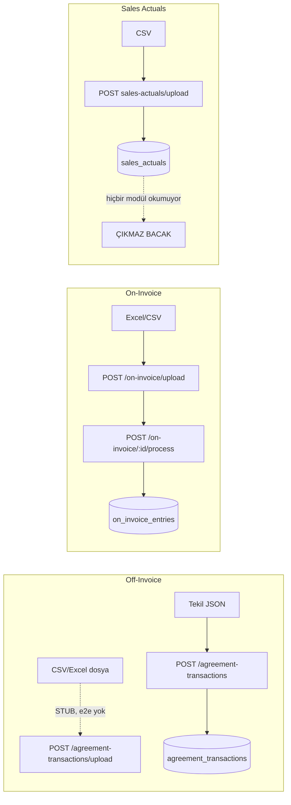
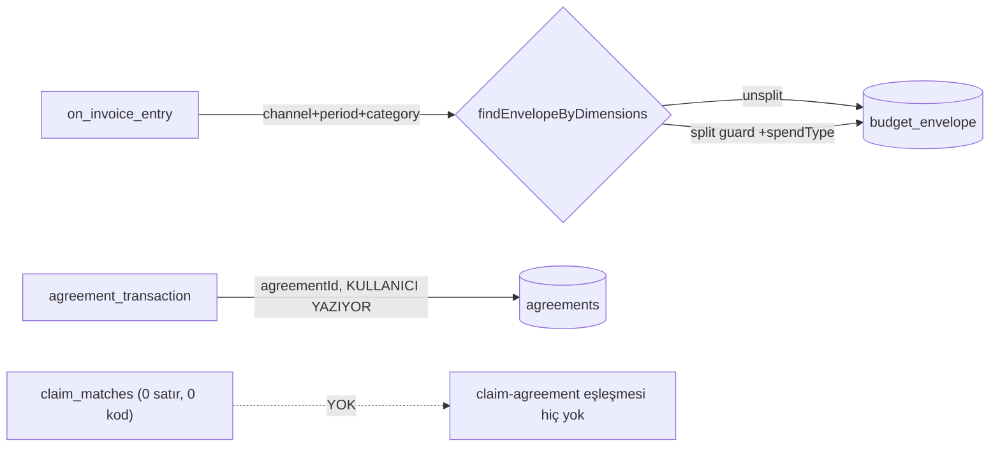
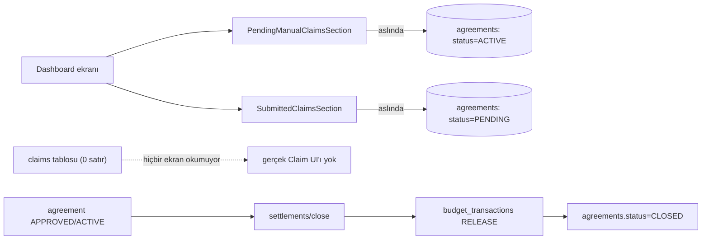
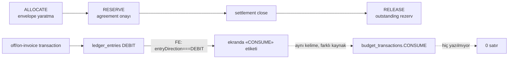

# DANIŞMAN PAKETİ — BÖLÜM 1: AKIŞ DOĞRULAMASI (taslak)

> **Tarih:** 2026-09-03 · **Yazan:** Team Lead (orkestrasyon) + `architect` × 2 ölçüm turu (arka planda, paralel)
> **Mod:** SALT-OKUMA + canlı gezinme + SQL. Kod/migration/e2e koşumu YOK.
> **Ortam:** `collmind-tpm-postgres` (port 5434, DB `collmind_tpm`, şema `main`) — **tek** çalışan container,
> hayalet `tpm` compose projesi **temiz** (`docker ps --filter "label=com.docker.compose.project=tpm"` → boş).
> Backend `npm run start:dev` (:3000), frontend `npm run dev` (:5173) bu tur için ayağa kaldırıldı.
> **Dayanak:** `docs/process/FAZ1_KAPANIS_BEYANI.md` §2 (2026-08-28 mührü — DEVRALINMADI, YENİDEN ÖLÇÜLDÜ) ·
> `docs/research/DEMO_EXCEL_KPI_TACTIC_REFERANSI.md` §4

## ✅ Screenshot durumu (güncellendi 2026-09-03)

İlk yazımda Browser aracının PNG'yi dosyaya kaydedemediği bir teknik kısıt vardı (Team Lead'in kendi
gezinme turu). Bu kısıt **kullanıcının kendi ortamından** dört rolü (Planner, Category Manager, Finance,
**Admin**) baştan sona salt-okuma modunda gezip 68 PNG + `docs/domain/screenshots/INDEX.md` üretmesiyle
aşıldı (hiçbir form submit edilmedi, hiçbir onay/red butonuna basılmadı). Aşağıdaki her halka bölümünde
gerçek dosya adları `INDEX.md`'ye referansla verilmiştir. Bu tur ayrıca **üç yeni bulgu** çıkardı — bkz.
§6.

---

## 0 · Özet mühür tablosu (bugünkü ölçüm)

| Halka | Mühür | Bir cümle |
|---|---|---|
| **1 · anlaşma/plan** | 🟡 **KOŞULLU** | Çekirdek `create→submit→approve/reject→return-to-draft` canlı ve **bu turda uçtan uca bizzat çalıştırıldı**; üç yeni ayırt edici boşluk var (Finance dalı UI'sız, tactic uygunluğu yalnız istemci-taraflı, kombinasyon-tavanı ulaşılamaz rota) |
| **2 · gerçekleşme** | 🟡 **KOŞULLU** | Off-invoice (tekil) + on-invoice canlı ve e2e-kanıtlı; off-invoice **dosya** yükleme yolu kodda var ama e2e'siz; `sales_actuals` kanıtlanmış **çıkmaz bacak** |
| **3 · eşleştirme** | 🟠 **KISMEN VAR** | Off-invoice'ta gerçekten yok (agreementId elle); on-invoice'ta **var** ama hedefi agreement değil bütçe zarfı — FAZ1'in "yok" hükmü fazla genişti |
| **4 · settlement/claim** | 🟠 **YARISI** | Settlement kanıtlı; claim şema-only; **dashboard'daki "Claim" bölümleri gerçekte `agreements` tablosunu okuyor** — yanıltıcı-canlı |
| **5 · defter** | 🟡 **KOŞULLU** (FAZ1'in 🟢'sinden **düşürüldü**) | Yön ayrımı (DEBIT/CREDIT) sağlam ve guard'lı; ama `budget_transactions.CONSUME` **hiç yazılmıyor**, ekrandaki "CONSUME" etiketi aslında `ledger_entries.DEBIT`'in ön-yüz çevirisi — iki defter aynı kelimeyi farklı anlamda kullanıyor, **bu turda ekranda bizzat görüldü** |
| **Statü akışı** | — | `PlanStatus` altı değerli; `EXPIRED` yazıcısız/okuyucusuz; Excel §4'ün 6 kalemine **3 yeni fark** eklendi |

---

## 1 · Halka 1 — Anlaşma/Plan

**Akış cümlesi:** Planner ay+CPL+kategori+kanal seçerek bir plan açar (ay aslında girilmez, dönem
başlangıç tarihinden **türetilir**); FU ekler, FU'ya bağlı SKU'lar grid'e düşer; SKU bazında hacim,
FU bazında mekanik/indirim girilir; her mutasyonda KPI motoru yeniden hesaplanır; plan submit edilince
düzenleme kilitlenir ve kategori-scope'u eşleşen bir Category Manager'ın onay kuyruğuna düşer; onayda
sistem uygun bir bütçe zarfı arar ve gösterir; onaylandığında bütçe commit edilir.

### Adım tablosu (mimari ölçüm turu + bu oturumun canlı yürütmesi)

| # | Adım | Route | Dosya:satır | Rol | Ekran | Etiket |
|---|---|---|---|---|---|---|
| 1 | Plan aç (ay+CPL+kategori+kanal) | `POST /plans` | `plan.controller.ts:74-75` → `plan.service.ts:289,352` | PLANNER, ADMIN | "Yeni Plan Oluştur" modalı | **[ÖLÇÜLDÜ]** — bu turda bizzat iki kez çalıştırıldı |
| 1b | "Ay" alanı yok, **türev** | — | `plan.service.ts:318` `toPeriodMonthUtc(startDate)` | — | form yalnız başlangıç/bitiş tarihi soruyor | **[ÖLÇÜLDÜ]** — Excel'de ay bir seçim, CTPM'de bir türev |
| 2 | FU ekle → SKU'lar iner | `POST /plans/:id/fus` | `plan.controller.ts:228-229` | PLANNER, ADMIN | grid, "FU Ekle" | **[ÖLÇÜLDÜ]** — CarrefourSA/Hair Care'de FU listesi boştu (`Bu kategori için FU bulunamadı`), CarrefourSA/Saç Boyası'nda 3 FU çıktı — FU-kategori eşleşmesi **veriye bağımlı**, sabit değil |
| 3 | Uygun tactic listesi | `POST /master-data/mechanics/applicable` | `mechanic.controller.ts:196` → `mechanic.service.ts:584-631` | 5/5 rol (read) | grid FU satırı, mekanik dropdown | **[ÖLÇÜLDÜ ama ayırt etmiyor]** — canlı `mechanics` tablosunda 6/6 satırda `applicable_cpls/channels/categories` **NULL** → resolver her zaman "uygun" döner. Yazma yolu (`updateFuTactic`, `plan.service.ts:641-690`) uygunluğu **hiç doğrulamıyor** — API'den doğrudan çağrılırsa uygun-olmayan mekanik de yazılabilir |
| 4 | Hacim (adet) | `PATCH /plans/:id/fus/:fuId/skus/:skuId/volume` | `plan.controller.ts:296-297` | PLANNER, ADMIN | SKU satırı, "Base Volume/Planned Volume" hücreleri | **[ÖLÇÜLDÜ]** — bu turda 10.000 girildi, GSV anında ₺1.000.000 hesaplandı (List Price ₺100 × 10.000) |
| 5 | İndirim/mekanik değeri | `PATCH /plans/:id/fus/:fuId/tactics` | `plan.controller.ts:246-247` | PLANNER, ADMIN | grid **FU satırı** (SKU değil — bkz. §4 fark tablosu madde 9) | **[ÖLÇÜLDÜ (mekanizma)] / bu turda GİRİLMEDİ** (submit uyarısı bunu doğruladı: *"has no mechanic values or tactics defined"*) |
| 6 | KPI hesabı | `POST /plans/:id/recalculate` + her mutasyonda servis-içi | `plan.controller.ts:541-542` → `kpi-engine.service.ts:99,138,278` | PLANNER, ADMIN | grid, "Yeniden Hesapla" | **[ÖLÇÜLDÜ]** — formüller DB'den okunuyor (`kpis` tablosu, 33 satır, `formula_text`), hardcode yok → CLAUDE.md §2.3 ihlali **yok** |
| 7 | Baseline yoksa RAG | — | RAG kadran motoru | — | grid "PLAN STATUS" satırı | **[ÖLÇÜLDÜ, bizzat görüldü]** — "Bu SKU için baseline (taban hacim) girilmemiş; ROI/uplift hesaplanamaz" → sonra hacim girilince "• GRİ · %0 kapsama". Sessiz sıfır **yok**, açık null-mesajı **var** (§2.5 uyumlu) |
| 8 | Submit | `POST /plans/:id/submit` | `plan.controller.ts:331-332` | PLANNER, ADMIN | "Onaya Gönder" → onay modalı | **[ÖLÇÜLDÜ, bizzat çalıştırıldı] iki kez** (Hair Care + Saç Boyası planı) |
| 8b | Submit-zamanı uyarılar (non-blocking) | — | — | — | "Dikkat edilmesi gerekenler" bandı | **[ÖLÇÜLDÜ]** — tam metin: *"FU ... has no mechanic values or tactics defined"* · *"PLAN_VOL eksik: spend hesaplanamadı. Plan gönderilebilir, ancak bütçe rezervasyonu bu eksiklik giderilmeden yapılamaz"* · *"RAG hesaplanamadı ... Renk bir yargı taşımıyor"* |
| 9 | Onay kuyruğu (CM) | `GET /plans/pending-approvals` | `plan.controller.ts:115-116` `@Roles(ADMIN,CM,READONLY)` | ⚠️ **FINANCE yok** | `/plan-approvals` sayfası | **[ÖLÇÜLDÜ, bizzat görüldü]** — bkz. §1a scope bulgusu |
| 10 | Onay detay + bütçe kontrolü | — | — | CM | "Plan Onay İncelemesi" modalı | **[ÖLÇÜLDÜ, bizzat görüldü]** — FU/SKU dökümü, gerçek ürün adı ("Koleston Supreme Kit 7/18..."), *"Onaylandığında ₺0 bütçe commit edilecektir"* notu |
| 11 | Onayla | `POST /plans/:id/approve` | `plan.controller.ts:425-426` | ADMIN, CM | "Onayla" → bütçe-zarfı modalı | **[ÖLÇÜLDÜ, bizzat çalıştırıldı]** — bkz. §1b |
| 12 | Reddet | `POST /plans/:id/reject` | `:456-457` | ADMIN, CM | "Reddet" butonu | **[ÖLÇÜLDÜ (API), denenmedi (UI'da bu turda)]** |
| 13 | Return-to-draft | `POST /plans/:id/return-to-draft` | `:482-483` | PLANNER, ADMIN | **FE çağıranı yok** | **[ÖLÇÜLDÜ (API) / YOK (UI)]** |
| 14 | Review (4 karar: approve/reject/request-changes/escalate) | `POST /plans/:id/review` | `:363-364` → `approval-workflow.service.ts:53` | ADMIN, CM, **FINANCE** (FM yalnız `PENDING_FINANCE_REVIEW` — ADR 0002) | **FE çağıranı yok** | **[ÖLÇÜLDÜ (API) / YOK (UI)]** |
| 15 | Escalate-to-finance | `POST /plans/:id/escalate-to-finance` | `:389-390` | ADMIN, CM | **FE çağıranı yok** | **[ÖLÇÜLDÜ (API) / YOK (UI)]** |

### §1a — Bu oturumda bizzat bulunan bir scope/veri-kapsama gerçeği

CM onay kuyruğu **rol bazlı değil kategori-scope bazlı** filtreleniyor (`access-scope.service.ts` deseni).
Doğrulama: `category.manager@wella.com` ile "Hair Care" kategorisindeki plan **hiç görünmedi**
(`GET /plans` → `[]`, boş dizi — network log'dan doğrudan okundu), oysa aynı plan Planner ekranında
canlıydı. Sebep bug değil **kasıtlı scope filtresi** — SQL ile doğrulandı:

```sql
-- main.user_scopes, category bazlı (CATEGORY_MANAGER için)
category.manager@wella.com → Saç Boyası, Set Boya
manager@wella.com          → Saç Boyası, Set Boya
category.manager2@wella.com → Şekillendirici
```

⚠️ **Ama ölçülen ek gerçek:** kategori evreni 8 (Diğer, Hair Care, Karma Koli, Köpük, Peroksit, Saç Boyası,
Şekillendirici, Set Boya) — bunlardan yalnız **3'ü** (Saç Boyası, Set Boya, Şekillendirici) bir CM
scope'una sahip. Diğer 5 kategoride açılan bir plan, **hiçbir seed-CM tarafından görülemez/onaylanamaz**:

```sql
SELECT u.email FROM users u JOIN user_scopes us ON us.user_id=u.id
WHERE us.category_id='<Hair Care id>' AND us.is_active;  →  0 satır
```

Bu bir kod kusuru değil **demo/seed veri kapsama boşluğu** — ama danışman paketinde önemli çünkü Hair
Care kategorisinde açtığımız ilk plan tam da bu yüzden "yetim" kaldı; ikinci bir plan Saç Boyası'nda
açılarak onay akışı tamamlandı (bkz. §1b).

### §1b — Onay anında bütçe-zarfı kontrolü (bu turda bizzat gözlendi)

CM "Onayla" dediğinde açılan modal:

```
✅ Bütçe Mevcut — Bu plan için uygun bütçe zarfı bulundu.
Bütçe Zarfı: NKA Channel Q2 2026 Budget   Kod: ENV-2026-NKA-Q2
Toplam Bütçe: ₺600.000        Kullanılabilir: ₺525.000
Plan Toplam Harcama: ₺0        "Bütçe yeterli. Onay sonrası ₺0 commit edilecektir."
```

Bu, Halka 1 → Halka 5 bağını **canlı** gösteriyor: onay anında sistem kanal+dönem boyutlarıyla bir
envelope arıyor (aynı `findEnvelopeByDimensions` deseni — bkz. Halka 3). Onaylandıktan sonra kuyruk
`BEKLEYEN: 0` oldu — geçiş **gerçekten çalıştı**.

### Statü enum'ları + geçiş tablosu

**`PlanStatus`** (`database/entities/plan.entity.ts:20-33`): `DRAFT · PENDING_APPROVAL ·
PENDING_FINANCE_REVIEW · APPROVED · REJECTED · EXPIRED`

⛔ `EXPIRED`: yazıcı **0**, okuyucu **0**, ve backend'de **hiç zamanlayıcı yok** (`@Cron`/`ScheduleModule`/
`setInterval` = 0 çağrı, `package.json`'da cron/schedule/bull/agenda bağımlılığı = 0).

| from → to | metod | route | rol | UI |
|---|---|---|---|---|
| ∅ → DRAFT | create | `POST /plans` | ADMIN, PLANNER | var |
| DRAFT → PENDING_APPROVAL | submit | `POST /plans/:id/submit` | ADMIN, PLANNER | var |
| PENDING_APPROVAL → APPROVED | approve | `POST /plans/:id/approve` | ADMIN, CM | var |
| PENDING_APPROVAL → REJECTED | reject | `POST /plans/:id/reject` | ADMIN, CM | var |
| REJECTED → DRAFT | returnToDraft | `POST /plans/:id/return-to-draft` | ADMIN, PLANNER | **yok** |
| PENDING_APPROVAL → PENDING_FINANCE_REVIEW | escalateToFinance | `/escalate-to-finance` veya `/review{ESCALATE}` | ADMIN, CM | **yok** |
| {PENDING_APPROVAL,PENDING_FINANCE_REVIEW} → APPROVED/REJECTED/DRAFT | review{...} | `POST /plans/:id/review` | ADMIN, CM, FINANCE | **yok** |
| DRAFT → *soft-deleted* | delete | `DELETE /plans/:id` | ADMIN, PLANNER | var ("Sil") |

**`AgreementStatus`** (`agreement.entity.ts:20-28`): `DRAFT · PENDING · APPROVED · ACTIVE · CLOSED ·
REJECTED · CANCELLED`. ⛔ **`ACTIVE`'in yazıcısı yok**, 8+ okuyucusu var — `dashboard.service.ts:607`
yalnız `status=ACTIVE` filtrelediği için o widget **yapısal olarak hep boş**.

### Excel §4 fark tablosu — güncellenmiş (3 yeni kalem eklendi)

| # | Demo kavramı | CTPM bugünü | Durum |
|---|---|---|---|
| 1 | `Planned` ara-durumu | yok; `DRAFT→PENDING_APPROVAL` tek adım | hâlâ geçerli |
| 2 | `Ongoing/Complete` (tarih-tetikli) | yok, ve **sebebi ölçüldü**: repoda hiç zamanlayıcı yok | hâlâ geçerli — kanıt güçlendi |
| 3 | `Incomplete` (END) | iki karşılığı var: `review{REQUEST_CHANGES}`→DRAFT (e2e 0, UI 0) ve `return-to-draft` (e2e 19, UI 0) | değişti: artık 2 "geri" yolu, ikisi de UI'sız |
| 4 | Promo locking lead time | yok | hâlâ geçerli |
| 5 | Draft-silme = fiziksel silme | **ölçüldü: SOFT delete** + `totalSpend>0` ise bütçe RELEASE | değişti: "ölçülmeli"→ÖLÇÜLDÜ, fark gerçek (CTPM daha güvenli) |
| 6 | Simülasyon ×3 | motor yok; `agreements.current/expected/competitor_price` kolonları var ama birim mi TL mi belirsiz | hâlâ geçerli |
| **7 (yeni)** | Approved'dan geri dönüş | Plan'da `APPROVED` **terminal**; Agreement'ta `APPROVED→CANCELLED` **var** | **yeni fark** — iki mod aynı soruya farklı cevap veriyor |
| **8 (yeni)** | Finance onay dalı | `PENDING_FINANCE_REVIEW`'a giden plan **hiçbir ekranda görünmez** (yalnız API'den kurtarılabilir) | **yeni — canlı kusur sınıfı** |
| **9 (yeni)** | Mekanik değerinin yaşadığı seviye | **FU düzeyi, SKU-override YOK** bugün (migration 1821/T-348 henüz uygulanmadı) | **yeni** |

### Mermaid — Halka 1

```mermaid
flowchart TD
  A[Planner: Yeni Plan\nay(türev)+CPL+kategori+kanal] --> B[FU Ekle]
  B --> C[SKU grid: hacim gir]
  C --> D[FU satırı: mekanik/indirim gir]
  D --> E[KPI motoru yeniden hesapla]
  E --> F{Baseline var mı?}
  F -- hayır --> F1[RAG: Baseline eksik / GRİ]
  F -- evet --> F2[RAG hesaplanır]
  E --> G[Onaya Gönder]
  G --> H{CM scope\nkategori eşleşiyor mu?}
  H -- hayır --> H1[Plan hiçbir CM'ye görünmez\nÖLÇÜLDÜ: 5/8 kategori scope'suz]
  H -- evet --> I[Plan Onayları kuyruğu]
  I --> J[CM: Detay İncele]
  J --> K[Onayla → bütçe zarfı aranır]
  K --> L[APPROVED, ₺ commit]
  I --> M[Reddet → REJECTED]
  I -.API-only, UI yok.-> N[review / escalate-to-finance /\nreturn-to-draft]
```

### Ekran görüntüsü listesi (gerçek dosyalar — `docs/domain/screenshots/`, tam liste `INDEX.md`'de)

- `0-planner-01-login.png` — Planner giriş ekranı
- `1-planner-02-dashboard-sifir.png` — Planner dashboard, "Aktif anlaşma 0 / Onay bekleyen 0"
- `1-planner-10-yeni-plan-modal.png` — Kanal/CPL/Kategori/Dönem seçimi (boş form, İptal ile kapatıldı)
- `1-planner-05-planlar-listesi.png` — 2 plan: biri ONAYLANDI, biri ONAY BEKLEYEN
- `1-planner-06-plan-detay-grid-onay-bekleyen.png` — Grid, "GRİ · %0 kapsama" + **sağ üstte "Forbidden
  resource" toast'ı bu ekranda da görülüyor** (bkz. §1 adım 1'in 403 notu)
- `1-planner-07-fu-sku-detay.png` — FU genişletilmiş, 3 SKU, "Baseline eksik"
- `1-planner-08-analiz-rapor.png` — Analiz & Rapor sekmesi: GP ROI Hesaplanmadı, Target ROI %20
- `1-planner-09-plan-detay-onaylandi.png` — Saç Boyası planı, durum ONAYLANDI
- `1-cm-04-plan-onaylari-bos-scope.png` — CM'in "Plan Onayları" ekranı: "Onay bekleyen plan
  bulunmamaktadır" (§1a'daki scope bulgusunun görsel kanıtı)
- `1-cm-02-onay-paneli-sifir.png` — CM dashboard "Onay Paneli", 0/0/0 — Planlar listesindeki 1 bekleyen
  plana rağmen burada 0 görünüyor (dashboard widget'ı Anlaşma-scope'lu, Plan-scope'lu değil)
- `1-admin-21-plan-onaylari.png` — **Admin** görünümünde aynı plan **görünür ve Onayla/Reddet butonlarıyla
  birlikte** — üç rolün aynı veriye üç farklı erişimi (Admin: tam · CM: scope-filtreli 0 · Finance:
  erişilemez, bkz. §6) tek ekranda karşılaştırılabilir

**Danışmana soru:** "Onaylanmış bir promosyon yürütmeye girdikten sonra geri alınabilir mi — ve bu
sektörde bir *statü geçişi* mi yoksa bir *ters kayıt* mı? Bizde Plan'da `APPROVED` terminal, Agreement'ta
`APPROVED→CANCELLED` açık; Excel modeli ise `Approved→Planned`/`Approved→Cancelled`'ı kilit-süresi
öncesinde açık tutuyor."

---

## 2 · Halka 2 — Gerçekleşme (actuals)

**Akış cümlesi:** Üç ayrı yükleme bacağı var (off-invoice indirim işlemi, on-invoice fatura satırı,
sales_actuals satış hacmi); üçü de kendi tablosuna yazıyor ama **birbirini beslemiyor** — özellikle
sales_actuals'ın yazdığı veriyi hiçbir modül okumuyor.

| Bacak | Route | Servis | DB tablo (satır) | Kanıt | Etiket |
|---|---|---|---|---|---|
| Off-invoice (tekil) | `POST /agreement-transactions` | `agreement-transaction.controller.ts:65` | `agreement_transactions` (3) | e2e `role-journey.e2e-spec.ts:4376,4526` | **[ÖLÇÜLDÜ]** |
| Off-invoice (dosya) | `POST /agreement-transactions/upload`, `/validate-and-import` | `:338,429` | aynı | e2e **yok** (yalnız parser'ın unit spec'i) | **[STUB]** kod tam, uçtan-uca kanıtsız |
| On-invoice | `POST /on-invoice/upload` → `:batchId/process` | `on-invoice.service.ts:461-534` | `on_invoice_batches`(0), `on_invoice_entries`(0) | e2e mutlu-yol + split-envelope kanıtlı | **[ÖLÇÜLDÜ]** (tek mutlu yol + bir split-case) |
| Sales actuals | `POST actuals-first/sales-actuals/upload` | `sales-actuals.controller.ts:52` | `sales_actuals`(3), `sales_actual_batches`(3) | e2e **çift pinli**: upload yazıyor VE hiçbir tüketici tabloyu değiştirmiyor | **[ÖLÇÜLDÜ] — kanıtlı çıkmaz bacak**, frontend'de de 0 sayfa |

DB satırları (3, 3, 0, 0) FAZ1'in "ikamet etmiyor" desenini taşıyor — e2e artığı, canlı kullanım değil.



**Danışmana soru:** Sektörde `sales_actuals` (gerçekleşen satış hacmi) genelde ROI/uplift hesabını
**doğrudan** besler; burada tamamen izole bir bacak olması bilinçli bir Faz-2 kararı mı, yoksa bir eksik
mi — off-invoice indirim verisi ile gerçekleşen satış hacmi sektör pratiğinde hiç mi ayrı tutulur?

---

## 3 · Halka 3 — Eşleştirme (matching)

**Akış cümlesi:** FAZ1'in "eşleştirme yok" hükmü **off-invoice için doğru** ama **on-invoice için fazla
genişti** — on-invoice'ta gerçek bir otomatik-eşleştirme var, sadece hedefi bir *anlaşma* değil bir
*bütçe zarfı*.

| Bacak | Grain / mekanizma | Kod | Etiket |
|---|---|---|---|
| Off-invoice | `agreementId` — kullanıcı CSV'de UUID olarak elle yazıyor | `off-invoice-file-parser.service.ts:218-246`, `create-agreement-transaction.dto.ts:14-15` | **[ÖLÇÜLDÜ]** otomatik bağ yok |
| On-invoice | `findEnvelopeByDimensions(tenantId, channel, fiscalPeriod, category)` — split-envelope varsa `+spendType` ile tipli çözüm | `on-invoice.service.ts:461-487` | **[ÖLÇÜLDÜ]** gerçek otomatik eşleştirme, ama hedefi **bütçe zarfı** |

"Eşleştirme yok" ifadesi **agreement/claim-eşleştirmesi** için doğru — bunun tam işi olacak
`claim_matches` tablosu 0 satır, 0 kod ile gerçekten yok.



**Danışmana soru:** On-invoice'un envelope-bazlı otomatik eşleşmesi (agreement değil, bütçe zarfı
seviyesinde) sektörde tanıdık bir tasarım mı, yoksa çoğu TPM ürünü on-invoice'u da doğrudan bir
anlaşmaya mı bağlıyor?

---

## 4 · Halka 4 — Hakediş / Settlement / Claim

**Akış cümlesi:** Settlement (anlaşma kapatma + bütçe RELEASE) canlı ve iyi kanıtlanmış; Claim tarafı
tamamen şema-only; ve **dashboard ekranındaki "Claim" bölümleri gerçekte Claim tablosunu değil,
`agreements` tablosunu okuyor** — bu, danışmana ekran gösterirken özellikle dikkat edilmesi gereken bir nokta.

| Parça | Route/Servis | DB (satır) | Kanıt | Etiket |
|---|---|---|---|---|
| Settlement close | `POST actuals-first/settlements/close/:agreementId` | `settlement-close.service.ts` | `agreements.status` geçişi + `budget_transactions` RELEASE | e2e `settlement-budget-release.e2e-spec.ts:205` (BR-E2E-02: cap=20000, DEBIT=12000 → close sonrası +20000 tam) | **[ÖLÇÜLDÜ]** |
| Claim | yok | `claims` entity var (8 durumlu enum, INTERNAL/EXTERNAL source) | `claims`=0, `claim_matches`=0 satır; servis/controller grep = 0 | **[STUB]** şema-only |
| Dashboard "Claim" bölümleri | `PendingManualClaimsSection`, `SubmittedClaimsSection`, `AwaitingInvoiceClaimsSection` | veri kaynağı `agreements` (status/consumedAmount filtresi) | `dashboard.service.ts:640-670`, kod yorumu hâlâ *"CTPM doesn't have a separate Claim entity yet"* (entity Ağustos'ta doğdu) | **[YANILTICI-CANLI]** — ekranda "Claim" yazıyor, altında gerçek Claim yok |



**Danışmana soru:** Dış talep (external claim) şemada `ClaimSource.EXTERNAL` olarak modellenmiş ama hiç
işlenmiyor; sektörde bu akış genelde nasıl tetikleniyor (e-posta/portal/EDI) ve bunu Faz-2'ye ertelemek
makul mü?

---

## 5 · Halka 5 — Defter (ledger)

**Akış cümlesi:** ALLOCATE (zarf yaratma) ve RESERVE (anlaşma onayı) canlı ve DB'de ikamet eden örnekleri
var; RELEASE (kapatma) yalnız e2e ile kanıtlı; **CONSUME hiçbir yerde yazılmıyor** — ve bu turda Finance
ekranında bizzat gözlenen bir bulgu bunu somutlaştırdı: kullanıcı arayüzünde "CONSUME" etiketiyle görünen
işlemler aslında `budget_transactions.tx_type=CONSUME` değil, **ayrı bir tablonun** (`ledger_entries`)
DEBIT yönünün ön-yüzde yeniden adlandırılmasıdır.

| Adım | Kod | DB tablo (satır) | Etiket |
|---|---|---|---|
| ALLOCATE | `budget.service.ts` (envelope yaratılışı) | `budget_transactions` tx_type=ALLOCATE (2 satır, örn. ₺500.000, 2026-08-19) | **[ÖLÇÜLDÜ]** ikamet eden örnek |
| RESERVE | agreement onayı | `budget_transactions` tx_type=RESERVE (4 satır, örn. ₺75.000) | **[ÖLÇÜLDÜ]** |
| CONSUME (enum) | **yazıcı yok** — kod yorumu itiraf ediyor: *"bu iki değer bugün hiçbir yazma yolunda kullanılmıyor"* (`budget-transaction.entity.ts:9-12`) | `budget_transactions` tx_type=CONSUME → **0 satır** | **[YOK]** — enum süsü, üretici yok |
| Gerçek tüketim | off/on-invoice transaction yaratılırken `ledger_entries` DEBIT satırı | `ledger_entries` entry_direction=DEBIT (3 satır) | **[ÖLÇÜLDÜ]** — `reversal.e2e-spec.ts:272` yön testi |
| RELEASE | `settlement-close.service.ts:176` | `budget_transactions` tx_type=RELEASE | **[ÖLÇÜLDÜ (e2e)]**, DB'de canlı ikamet eden örnek yok |
| Yön guard'ı | `scripts/guards/ledger-direction.sh` | — | bu tur çalıştırıldı → **exit 0** |

### §5a — Bu turda Finance ekranında bizzat doğrulanan iki bulgu

**(i) "CONSUME" etiketi bir ön-yüz çevirisi.** `/budget/ledger` ("Financial Ledger — Read Only")
ekranında 3 kayıt "CONSUME" tipiyle listelendi. Frontend kaynağı ölçüldü:

```ts
// collmind.frontend/src/components/budget/BudgetLedgerPage.tsx:71-76
const getTransactionType = (entry: LedgerEntry): TransactionType => {
  if (entry.entryDirection === 'DEBIT') return TransactionType.CONSUME;
  return TransactionType.RESERVE;
};
```

Yani ekran `ledger_entries.entryDirection` alanını okuyup DEBIT'i "CONSUME" diye etiketliyor —
`budget_transactions.tx_type` sütununu **hiç sorgulamıyor**. Sonuç: "CONSUME işlemi 0 satır" (backend
tablosu) ile "ekranda 3 CONSUME kaydı var" (frontend etiketi) **ikisi de doğru**, çünkü iki farklı katmandan
bahsediyorlar — ama bu ayrım hiçbir yerde yazılı değil. Bir danışman bu ekranı görüp "CONSUME lifecycle'ı
çalışıyor" sonucuna varabilir; DB'de o adı taşıyan bir olay hiç üretilmiyor.

**(ii) Bütçe panelinde "Consumed ₺0" ile "Available" tutarsız görünüyor.** `/budget?view=list`
("Bütçe Yönetimi") ekranı: Toplam Tahsis ₺1.600.000 · **Consumed ₺0** · Available ₺1.428.500 (%89,3).
Aritmetik: 1.600.000 − 1.428.500 = 171.500 — bu fark ne "Consumed" kartında ne başka bir kartta ayrı
gösteriliyor (muhtemelen RESERVE tutarı, ama ekran bunu adlandırmıyor). Bu, `budget_transactions.CONSUME`
enum'unun ölü olmasının **kullanıcı tarafında görünen sonucudur**: Finance kullanıcısı "hiçbir şey
tüketilmemiş" okur, oysa bakiye zaten düşmüştür.



**Danışmana soru:** İki paralel defter (`budget_transactions` rezervasyon defteri + `ledger_entries`
tüketim defteri) ve aynı "RESERVE/CONSUME" kelimelerinin iki katmanda farklı anlam taşıması sektörde
tanıdık mı, yoksa çoğu TPM ürünü tek bir defter üzerinden mi gidiyor?

---

## 6 · Ek tur (2026-09-03) — Admin rolü + üç yeni bulgu

Kullanıcının ekran-görüntüsü turu Admin rolünü de kapsadı (31 ekran) ve üç halkanın dışında, ama Bölüm 1
danışman paketi için değerli üç yeni bulgu çıkardı. Kaynak: `docs/domain/screenshots/INDEX.md`.

### 8a — "Finans Paneli" React çökmesi (CM + ADMIN) — **[HATA], P0**

`0-cm-07-finans-paneli-hata.png` ve `0-admin-25-finans-paneli-hata.png`: sol menüden "Finans Paneli"
açılınca **her iki rolde de** aynı React error boundary — *"Rendered more hooks than during the previous
render"* — ve iki toast: *"No budget envelope... a utilization figure cannot be computed"* ile
*"property startDate/endDate should not exist"*. Planner'da bu menü öğesi yok; Finance'ta sorunsuz açılıyor.
Role-bağımsız bir render hatası olması muhtemel (klasik koşullu-hook belirtisi). Task: [[T-370]].

### 8b — Yetkisiz rotada sessiz `/dashboard` yönlendirmesi — **[ULAŞILAMADI], P2**

İki ayrı rol, ikişer farklı rota, üçer kez doğrulandı:
```
CM      → /budget/ledger      → sessizce /dashboard'a döner (menüde link VAR, sayfa AÇILMIYOR)
FINANCE → /plan-approvals     → sessizce /dashboard'a döner (menüde link VAR, sayfa AÇILMIYOR)
```
Bu, §1a ve Halka 1'deki "FE çağıranı yok" tespitinin **doğrudan görsel kanıtı** — ama daha genel bir
desen: route-guard fail-closed çalışıyor (güvenlik doğru), fakat kullanıcıya **açıklamasız**. Task: [[T-371]].
`5-cm-06-ledger-erisilemedi-dashboarda-yonlendi.png`, `1-finance-05-plan-onaylari-erisilemedi.png`.

### 8c — `/agreement-approvals` ("Anlaşma Onayları") — Bölüm 1'de adlandırılmamış ayrı bir ekran

`0-admin-19-anlasma-onaylari.png`: Admin'e özgü, `Planlama > Plan Onayları`'ndan **tamamen farklı** bir
onay kuyruğu — Anlaşma (Agreement) nesnesinin kendi onay akışı (bkz. `AgreementStatus` geçiş tablosu,
Halka 1 §"Statü enum'ları"). Şu an boş (Bekleyen 0). Bu, ürün içinde **iki paralel onay kuyrusu**
olduğunu doğruluyor — biri Plan (Planner→CM), biri Agreement (muhtemelen farklı bir akış/rol seti) için.
Bölüm 1'in ilk yazımı yalnız Plan onay akışını kapsamıştı; Agreement onay akışı ayrı bir ölçüm turu
gerektirir (bug değil, **envanter eksiği** — bu taslağa not düşüldü, yeni task açılmadı).

### 8d — Bilinen/düşük öncelikli iki envanter notu

- **Audit Log stub** (`0-admin-18-audit-log-stub.png`, "Bu sayfa yakında eklenecek") — bu **mevcut
  [[T-326]] ile aynı bulgu** (denetim ekranı: API hazır, sayfa stub — FAZ1 ölçüt-4'ün "görme yarısı").
  Yeni task açılmadı, çapraz-referans yeterli.
- **Bölge Yönetimi boş** (`0-admin-17-bolge-yonetimi-veri-yok.png`, "Henüz kayıt bulunmamaktadır") —
  sistemde hiç bölge tanımlanmamış. 5-halka akışını doğrudan etkilemiyor (bölge, CPL/kanal gibi bir
  planlama ekseni olarak kullanılmıyor bugün); düşük öncelik, ayrı task açılmadı.

### 8e — Rol × erişim matrisinin görsel özeti (Plan Onayları ekranı üzerinden)

| Rol | `/plan-approvals` sonucu | Kaynak |
|---|---|---|
| ADMIN | Tam görünür, 1 bekleyen plan, Onayla/Reddet aktif | `1-admin-21-plan-onaylari.png` |
| CATEGORY_MANAGER | Sayfa açılıyor ama **0** (kategori-scope filtresi, bekleyen plan Hair Care'de) | `1-cm-04-plan-onaylari-bos-scope.png` |
| FINANCE | Sayfa **hiç açılmıyor**, sessizce `/dashboard`'a döner | `1-finance-05-plan-onaylari-erisilemedi.png` |

Aynı üçlü ayrım "Anlaşmalar" listesinde de ölçüldü: Planner/Finance/Admin 5 kayıt görüyor, CM 0
(`1-cm-08-anlasmalar-liste-bos-scope.png`) — kategori-scope'un plan dışındaki ekranlara da yayıldığının
kanıtı.

## 7 · Ölçemediğim / bu turda tamamlanmayan noktalar

- **[ÖLÇEMEDİM — koşum]** Hiçbir e2e suite bu turda çalıştırılmadı (mod: salt-okuma + `T-325` kilidi);
  "e2e var ve ayırt edici" ölçüldü, "bugün yeşil" ölçülmedi.
- **[ÖLÇEMEDİM]** `<500ms` NFR'sinin gerçek gecikmesi — kapı yok, telemetri var, canlı sayı üretilmedi.
- **[ÖLÇEMEDİM]** `review{REQUEST_CHANGES}` dalının davranışı — e2e yok, UI yok, `plans=0` ⇒ bu yol bugün
  hiç koşmuyor; "çalışıyor" da "bozuk" da denemez.
- **[ÖLÇEMEDİM]** On-invoice okuma yüzeyinin (template excel/csv, entries listesi) e2e kapsamı yeniden
  doğrulanmadı, yalnız upload→process mutlu-yolu bu turda ölçüldü.
- **[ÖLÇEMEDİM]** `app_runtime`'ın canlı bir `SET ROLE` ile gerçek INSERT yapıp yapamadığı — yalnız statik
  ACL (`pg_class.relacl`) üzerinden çıkarım yapıldı.
- **Kısmen çözüldü:** Finance dashboard'ında "Tüm anlaşmaları gör (29)" yazıyordu; aynı turda SQL ile
  `main.agreements` = 5 satır ölçülmüştü. Ekran-turu bu farkı netleştirmedi ama daraltı: Planner/Finance/
  Admin'in **Anlaşmalar listesi** ekranının kendisi tutarlı şekilde **5** kayıt gösteriyor
  (`1-planner-12-anlasmalar-liste.png`, `1-finance-06-anlasmalar-liste.png`, `1-admin-22-anlasmalar-liste.png`
  — üçü de "Toplam Anlaşma 5, STA:4/LTA:1, Toplam Cap ₺295.000"). Yani `(29)` yalnız dashboard'daki hızlı-
  erişim linkinin **kendi metninde** — muhtemelen bayat/statik bir sayı, gerçek listeyle beslenmiyor. Kesin
  kaynağı (kod satırı) hâlâ doğrulanmadı — küçük, ayrı bir ölçüm.

## 8 · Kullanılan kaynaklar (özet)

- `docs/process/FAZ1_KAPANIS_BEYANI.md`, `docs/research/DEMO_EXCEL_KPI_TACTIC_REFERANSI.md`
- `.claude/backlog/tasks/T-324,T-346,T-357,T-358,T-360,T-362.md`
- Backend: `modules/modes/planning-first/plan/{plan.controller,plan.service}.ts`,
  `modules/modes/actuals-first/{agreement-transaction,on-invoice,sales-actuals,settlement}/*`,
  `modules/master-data/mechanic/*`, `modules/shared/kpi-engine/kpi-engine.service.ts`,
  `database/entities/{plan,agreement,budget-transaction,ledger-entry,claim}.entity.ts`
- Frontend: `components/features/plans/*`, `components/budget/{BudgetLedgerPage,BudgetDashboard}.tsx`,
  `routes/index.tsx`
- E2E: `role-journey.e2e-spec.ts`, `plan-review-decision.e2e-spec.ts`, `plan-escalate-to-finance.e2e-spec.ts`,
  `settlement-budget-release.e2e-spec.ts`, `sales-actuals-consumer-absence.e2e-spec.ts`,
  `on-invoice-residency.e2e-spec.ts`, `on-invoice-split-envelope.e2e-spec.ts`, `reversal.e2e-spec.ts`
- Canlı DB sorguları: bu oturumda `docker exec collmind-tpm-postgres psql` ile, şema `main` nitelendirilerek
